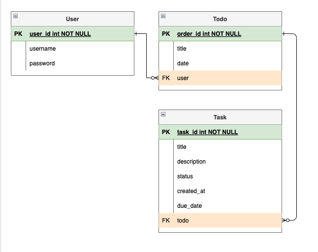

# todo

## database design

you can see  [here](https://drive.google.com/file/d/1pNz29YFxT_496TRAdBtUTDqLWXpQ5K2k/view?usp=sharing)

## Endpoints

### Todo

| Endpoint                    | Method | Description                                      |
|-----------------------------|--------|--------------------------------------------------|
| `/api/v1/users/`               | GET    | Get a list of all users                          |
| `/api/v1/users/{user_id}/`     | GET    | Get details of a specific user                   |
| `/api/v1/users/{user_id}/todos/`               | GET   | Get a list of todos                                |
| `/api/v1/users/{user_id}/todos/`               | POST   | Create a new todo                                |
| `/api/v1/users/{user_id}/todos/{todo_id}/`     | PUT    | Update details of a specific todo                |
| `/api/v1/users/{user_id}/todos/{todo_id}/`     | DELETE | Delete a specific todo                           |
| `/api/v1/users/{user_id}/todos/{todo_id}/tasks/`               | GET   | Get a list of tasks                                |
| `/api/v1/users/{user_id}/todos/{todo_id}/tasks/`               | POST   | Create a new task                                |
| `/api/v1/users/{user_id}/todos/{todo_id}/tasks/{task_id}/`     | PUT    | Update details of a specific task                |
| `/api/v1/users/{user_id}/todos/{todo_id}/tasks/{task_id}/`     | DELETE | Delete a specific task                           |
